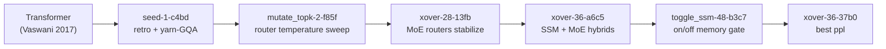
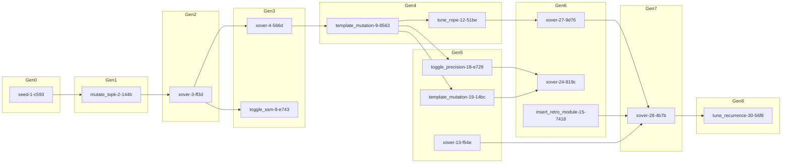
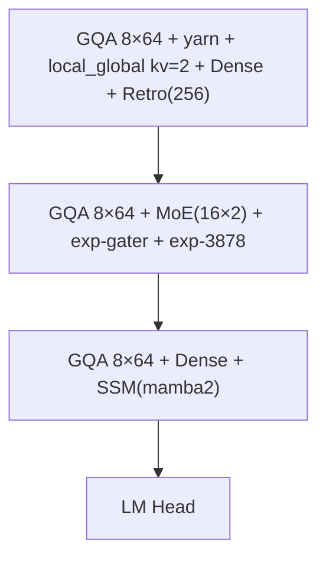

# Transformer Evolution LLM

We’re building an autonomous evolution loop that invents new LLM blueprints we can later scale to full-production budgets. Typed Transformer DSL + mutation templates + checkpoint-aware crossover let us rewrite architectures in YAML, reuse weights after every mutation, and keep an auditable lineage for each discovery. This repository captures the first step of that journey: validating the loop with ~100 M parameter surrogates trained for a few hundred steps so we know which designs deserve the expensive scaling pass.

## What we set out to learn

- Can we evolve genuinely new LLM blueprints—beyond familiar transformer tweaks—using only ~100 M parameter surrogates trained for a few hundred steps?
- Do hybrids (retro memory + sparse attention + MoE/SSM toggles) outperform single tricks when tokens are scarce?
- Is a fully-auditable lineage (JSON + “subway” renders) enough to explain breakthroughs instead of hand-wavy anecdotes?

## What we’re seeing so far

Recent phi-creative sweeps (Pareto-uniform + lexicase) spawned 54 frontier survivors across ~48 generations (`runs/frontier_phi_creative_unbiased.json`, `runs/frontier_phi_creative_overnight_lexi.json`). The runs share the same DSL, mutation deck, and checkpoint-aware crossover; only the selection strategy changes. Diversity is enforced by the selector, not by ad-hoc weighting.

- **Canonical creative sweep (Nov 15)** reseeded from the best hybrid (`configs/seed_xover-48-9237.yaml`), enabled a composite objective `ppl_per_long_recall = ppl_code / max(long_recall, 0.1)`, and relaxed trainer guards so throughput is recorded. Artefacts live at `runs/frontier_phi_creative_canon.json`. The best balanced model (`mutate_topk-24-6bee`) is a 14-block MoE+retro+recurrence stack (`ppl≈2.3e4`, `long_recall≈0.57`, `throughput=0`). The same run also exposed a corner case: recurrence-heavy 1-layer toys produced `long_recall>1` and collapsed the ratio, so the next sweep will clamp that proxy before trade-off analysis.
- `xover-36-37b0` hit `ppl_code ≈1.05` while keeping throughput above `1.36 k tok/s` by fusing local_global attention, a MoE(16×2) block, retro gates, and a single mamba2 SSM slice.
- `xover-39-204f` stretched long-recall to `≈0.75` with three retro adapters and sparsity; it happily paid throughput (~930 tok/s) to win on horizon length.
- `toggle_ssm-30-d493` delivered `≈1.53 k tok/s` by letting the DSL flip SSM blocks on/off without rewriting code, quantifying the latency cost of “smart” memory.
- Pareto-uniform kept both throughput-first and quality-first niches alive. We did not have to guess weights ahead of time; the frontier surfaced the trade-offs for us.

### Standout Pareto points

| Role | Model | Key ingredients | Metrics |
| --- | --- | --- | --- |
| Depth scout | `xover-36-37b0` | local_global heads + MoE(16×2) + retro gate + mamba2 SSM | `ppl_code ≈1.05`, `throughput ≈1.36 k tok/s`, `long_recall ≈0.33` |
| Horizon hoarder | `xover-39-204f` | triple retro adapters + sparse attention, MoE kept tiny | `long_recall ≈0.75`, `throughput ≈930 tok/s`, `ppl_code ≈1.38` |
| Throughput anchor | `toggle_ssm-30-d493` | SSM toggle + kv_groups compression + retro pair | `throughput ≈1.53 k tok/s`, `ppl_code ≈1.48`, `long_recall ≈0.67` |

## Signals we keep seeing

- Memory + sparsity synergize: local_global attention with short-horizon retro keeps KV modest while improving perplexity and long-recall.
- Hybrids beat single tricks: MoE + SSM shows up in every top-quality model; toggling SSM quantifies the throughput tax.
- Diversity without weights: Pareto-uniform preserved both high-throughput and high-quality niches without us hand-weighting layers/MoE.
- DSL velocity: adding sparsity + router knobs to the schema instantly expanded the search space; template mutations spread those knobs consistently across layers.

## Evolution at a glance

Lineages are exported as JSON and rendered as Mermaid so you can see ideas branch, merge, and sometimes disappear. Below are two complementary views derived from the recent phi-creative runs.

### River of ideas (seed → champion)



### Architectural subway (condensed view)



Render the full subway diagram anytime:

```bash
python scripts/render_lineage_subway.py runs/frontier_phi_creative_overnight_lexi_lineage.json \
  --out runs/creative_overnight_lexi_subway.mmd
```

<details>
<summary>Field notes from recent sweeps</summary>

- Selectors: Pareto-uniform (no scalarized weights) on the frontier run, lexicase overnight. Optimizer stayed fixed at AdamW so architectural edits stayed comparable.
- Mutation deck: local_global sparsity knobs, router tuning, MoE/SSM toggles, recurrence/retro insertion, rope jitter, and template mutations that touch whole layer stacks.
- Artefacts: metrics in `runs/frontier_phi_creative_unbiased.json`; lineage nodes in `runs/frontier_phi_creative_unbiased_lineage_from_log.json`.

#### Cross-section of the best-ppl architecture (`xover-36-37b0`)



#### Deep dive: constraints, DSL impact, and architectural sinks

**Why constraints shaped outcomes**
- Single-machine budgets force KV and throughput awareness; deep SSM stacks are penalized on MPS, so hybrids that place SSM sparingly do better.
- StaticChecker size/KV/throughput gates filter out untrainable configs quickly, keeping exploration focused.
- Pareto-uniform selection (vs weighted) avoids steering toward layers/MoE and surfaces diverse trade-offs naturally.

**How the DSL helped**
- New knobs (sparsity: local_global, qk_norm_max; router temperature/aux) became searchable as soon as they were added to the schema—no extra Python mutations needed.
- Template mutations emit edits across blocks consistently; StaticChecker keeps dimensions valid.
- Composite metrics can be declared directly in YAML (`evolution.composite_metrics`). The runner now derives them automatically, letting us bias lexicase toward “quality-per-long-recall” instead of rewarding pathological single-block runs.

**Architectural “sinks” rediscovered across runs**
- Single-block, multi-horizon memory (triple retro) for speed.
- Sparse attention + retro (local_global + retro) for longer horizons at modest KV.
- MoE + SSM hybrids for quality when budgets allow (exposed via toggle_ssm trade-offs).

</details>

## Lineage & artefacts

- Frontier metrics: `runs/frontier_phi_creative_unbiased.json` (Pareto) and `runs/frontier_phi_creative_overnight_lexi.json` (lexicase).
- Lineage graphs: `runs/frontier_phi_creative_unbiased_lineage_from_log.json`, `runs/creative_overnight_lexi_lineage.mmd`, and `runs/phi_recur_subway.mmd`.
- Scale-hop seeds: `configs/scalehop_xover-68-8a93.yaml` widens the best-ppl winner to ~400 M params; see `docs/gpu_run_plan.md`.

<details>
<summary>Run it yourself (setup, smoke tests, sweeps)</summary>

```bash
# Setup
python -m venv .venv && source .venv/bin/activate
make setup
cp .env.example .env  # add HF_TOKEN=... if needed
export $(cat .env | xargs)

# Smoke test (CPU)
HF_TOKEN="$HF_TOKEN" python scripts/run_live.py \
  configs/live_smoke.yaml --generations 3 --steps 40 --device cpu \
  --out runs/frontier_live_smoke.json

# Full sweep (MPS or CUDA)
AGENT_MODE=baseline HF_TOKEN="$HF_TOKEN" python scripts/run_live.py \
  configs/live_phi_tiny.yaml --generations 48 --steps 200 \
  --eval-batches 4 --device mps \
  --checkpoint-dir runs/checkpoints_phi_tiny \
  --out runs/frontier_phi_tiny.json --seed 1234 --cleanup-old-checkpoints
```

Monitor any run: `tail -f runs/<name>.log` (e.g. `runs/multibranch_weighted.log`).

**Requirements**: Python 3.11+, a Hugging Face token in `.env`, and either CPU, MPS, or CUDA for the short surrogate runs.

</details>

<details>
<summary>Export a frontier winner as a new seed</summary>

```bash
python scripts/export_seed.py runs/frontier_phi_loop_long.json \
  --id mutate_topk-30-bbb0 \
  --out-config configs/seed_mutate_topk.yaml \
  --checkpoint-dir runs/checkpoints_phi_loop_long \
  --out-checkpoint runs/seeds/mutate_topk-30-bbb0.pt
```

Start your next run from `configs/seed_mutate_topk.yaml`; if you provided `--out-checkpoint`, the very first candidate can reuse trained weights.

</details>

## Appendix: operator notes

<details>
<summary>Operator appendix (scale, knobs, ablations, scoring)</summary>

### Scale & portability

- The current phase runs on single-machine surrogates (~100 M parameters, 200–260 step finetunes, local throughput/RAM proxies) so we can vet ideas quickly before investing in large-scale training.
- The methodology (DSL + template mutation + checkpoint-aware evolution + weighted selection) **does generalize**:
  - Swap a bigger spec in `configs/` (wider dims, more heads/experts) and raise `train.max_tokens`, `--steps`, and generations.
  - Keep `grad_ckpt` on; expect heavier MoE/SSM stacks to need more tokens before routers stabilize.
  - Re-tune `--score-weight-*` for production priorities (e.g., raise throughput weight if serving latency dominates; raise layers/MoE if quality is king).
- What’s intentionally out-of-scope here: distributed trainers/ZeRO/TPU setups and true cluster-level SLOs. Treat these runs as **architecture scouting**, then re-train winners at scale.

### Sparse attention patterns

- The DSL supports `sparsity: none|sliding|block|local_global|dilated|local_block`.
- `sliding` uses `sliding_window` (`sw`) tokens to each side.
- `block` uses `block_size`/`block_stride` windows along the diagonal.
- `local_global` combines a local window with periodic global tokens every `global_stride` steps (plus token 0). The mutation engine explores these knobs automatically via `tune_attn`.
- `dilated` allows attention to tokens that share the same index mod `dilation`.
- `local_block` overlays a sliding window with block windows (configured by `block_size`/`block_stride`), acting like periodic “memory stations.”

### Other knobs

- Global normalization: set `model.norm: layernorm|rmsnorm`.
- KV compression: `attn.kv_groups` can be tuned by evolution (e.g., 1/2/4) to reduce KV cache.
- RoPE base: `attn.rope_theta` adjusts the rotational base (default 10000); mutations can jitter it.

### Optimizers (run-level option)

Keep architecture changes comparable by default with AdamW. You can switch optimizers via the DSL without changing code:

```yaml
optimizer:
  name: lion    # or adamw
  lr: 3.0e-4    # overrides train.lr if set
  betas: [0.9, 0.99]
  weight_decay: 0.01
```

Evolution does not mutate the optimizer by default (to avoid confounding); you decide per-run.

### Scaling tools

- Fit scaling-law priors from existing runs:

```bash
python scripts/fit_scaling.py runs/frontier_phi_creative_unbiased.json \
  runs/frontier_phi_creative_overnight_lexi.json
```

This prints log-log slopes (ppl vs params, tokens vs params, throughput vs hidden×heads) and extrapolated targets.

- See `docs/scale_policy.md` for recommended priors (head_dim≈64, FFN≈4×d, kv_groups≈2, local_global windows ≈ √L × scale) and a checklist for 350 M–1 B scale hops.
- Scale-hop seed: `configs/scalehop_xover-68-8a93.yaml` widens the best-ppl winner to ~400 M params (1536-dim, RMSNorm, kv_groups=2, local_global/local_block/dilated sparsity). Use it on GPU machines with the guidance in `docs/gpu_run_plan.md`.

### Trainer thresholds

Tune early-stop knobs directly in YAML (defaults shown):

```yaml
train:
  entropy_threshold: 0.5
  entropy_patience: 3
  instability_threshold: 5.0
  no_improve_patience: 20
  improvement_tolerance: 1e-3
  ppl_stop_threshold: 2.5   # set null to disable the rung-1 PPL gate
```

These map to the trainer’s entropy/instability/no-improvement guards and the rung‑1 perplexity stop that the evolution runner uses before the full training rung.

The trainer also logs stability telemetry per candidate:

- `stop_reason_code`: 0 = full run, 1 = high_grad, 2 = low_entropy, 3 = no_improve.
- `nan_seen`: 1.0 if any NaN/Inf was observed in loss or gradients, else 0.0.
- `loss_spike`: largest single-step increase in training loss vs the best-so-far.

### Depth recurrence

- Wrap contiguous layer ranges in a recurrence loop using `model.recurrences`:

```yaml
recurrences:
  - start: 1
    end: 4
    adapter: gated      # or linear
    concat_prelude: true
    train_recurrence: 1
    max_train_recurrence: 4
    curriculum_fraction: 0.25
    test_recurrences: [1, 2, 4, 8, 16]
```

- The trainer ramps train-time recurrences over the specified curriculum fraction, then evaluates (and logs) `ppl_code_rec_*` plus `recurrence_gain` at the requested test recurrences.
- Example config: `configs/live_phi_creative_recur.yaml` (includes a short “healing” phase via `data.healing_shards` before fine-tuning on reasoning-heavy shards).

Run a recurrence-aware sweep:

```bash
HF_TOKEN="$HF_TOKEN" python scripts/run_live.py configs/live_phi_creative_recur.yaml \
  --generations 24 --steps 260 --device mps \
  --checkpoint-dir runs/checkpoints_phi_recur \
  --out runs/frontier_phi_recur.json --cleanup-old-checkpoints

# Canonical creative sweep (seeded hybrid + composite metric)
PYTHONPATH=src python scripts/run_live.py configs/seed_xover-48-9237.yaml \
  --generations 48 --steps 360 --eval-batches 6 --device mps \
  --checkpoint-dir runs/checkpoints_phi_creative_canon \
  --out runs/frontier_phi_creative_canon.json --seed 9999 \
  --parent-selection lexicase \
  --score-weight-long-recall 1.2 --score-weight-throughput 1.0 \
  --score-weight-ram 0.8 --score-weight-moe 1.0
```

### Ablation harness

Probe how much each motif matters for a frontier winner:

```bash
python scripts/run_ablation.py runs/frontier_phi_creative_overnight_lexi.json \
  --top-n 2 --device mps --steps 60 --ablation retro_off --ablation kv_groups_to_dense
```

This runs short finetunes on ablated specs (retro off, local_global→sliding, kv_groups→1, rope theta reset, norm swap, remove SSM/MoE) and writes `runs/ablation_report.json` with metric deltas.

### Biasing parent selection

All metrics are equal by default. Heavier weights push toward deeper MoE variants:

```
--score-weight-ppl 2.0 \
--score-weight-throughput 0.3 \
--score-weight-long-recall 1.2 \
--score-weight-ram 0.5 \
--score-weight-layers 1.5 \
--score-weight-moe 1.5
```

You can also steer exploration with:
- `--score-weight-novelty` (maximized) to encourage structural diversity
- `--score-weight-instability` (minimized) to penalize high grad norms

</details>
