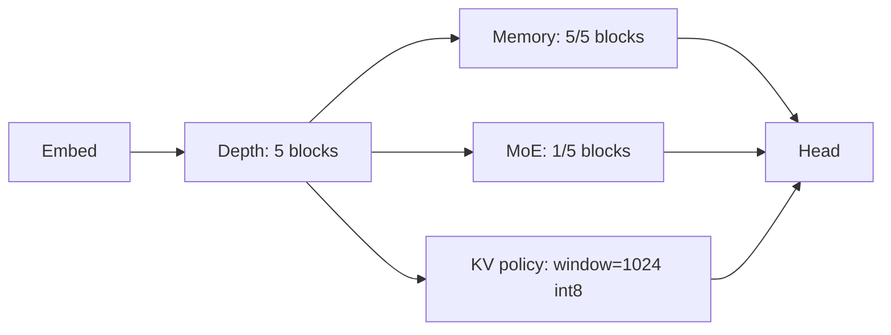
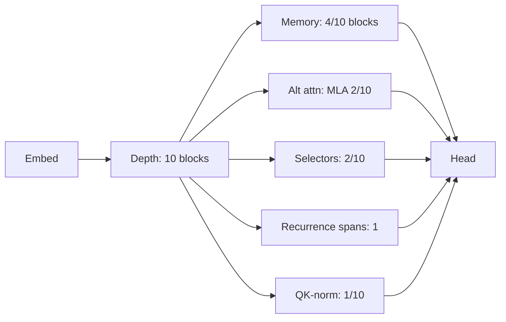
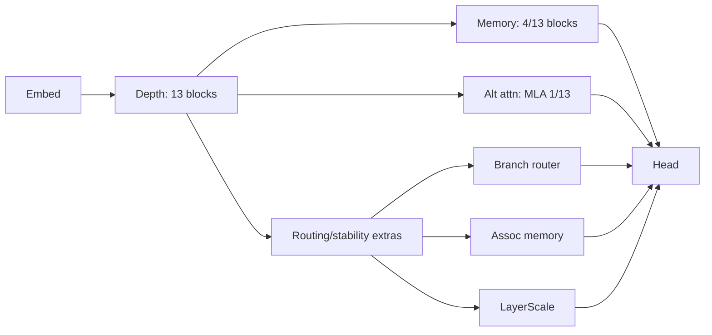

# Transformer Evolution LLM
[](https://deepwiki.com/strangeloopcanon/transformer-evolution-llm)

An autonomous evolution loop that invents new LLM blueprints. This system uses a typed DSL, mutation templates, and checkpoint-aware crossover to evolve Transformer architectures that are optimized for specific constraints (perplexity, throughput, memory).

Instead of just tuning hyperparameters, this project evolves the *topology* of the model itself—inserting memory blocks, switching attention types (dense/sparse/linear), toggling MoE/SSM layers, and wiring complex residual paths—while reusing weights to avoid training from scratch.

## Key Features

- **Typed DSL**: Architectures are defined in YAML/JSON using a strict Pydantic-based schema (`src/transformer_evolution_llm/dsl.py`), ensuring all generated candidates are valid by construction.
- **Weight Inheritance**: "Lamarckian" evolution where child models inherit trained weights from parents, significantly reducing the compute needed to validate new designs.
- **Multi-Objective Optimization**: Uses Pareto frontiers to trade off conflicting goals like Perplexity vs. Throughput vs. Parameter Count.
- **Rich Mutation Primitives**: Includes structural mutations (add/remove blocks, split layers), component swaps (Attention ↔ MoE ↔ SSM), and hyperparameter tuning.
- **Audit Lineage**: Every discovery comes with a full JSON lineage and visualization tools, explaining exactly *how* a specific architecture was derived.

## Installation

### Prerequisites
- Python 3.11+
- A compatible accelerator (CUDA, MPS, or CPU)
- `uv` (used by `make setup`)
- [Optional] A Hugging Face token (for dataset access): `HF_TOKEN`

### Setup

```bash
# 1. Clone the repository
git clone https://github.com/strangeloopcanon/transformer-evolution-llm.git
cd transformer-evolution-llm

# 2. Create the venv + install dependencies (uses uv)
make setup
source .venv/bin/activate
```

Optional environment:

- `export HF_TOKEN="..."` (only needed for Hugging Face dataset access)
- `export TOKENIZERS_PARALLELISM=false` (avoids tokenizers fork warnings)

## Quick Start

### 1. Run a Smoke Test
Verify the installation by running a tiny evolution loop on CPU:

```bash
export TOKENIZERS_PARALLELISM=false
RUN="runs/live_smoke_$(date +%Y%m%d_%H%M%S)"
mkdir -p "$RUN"

python scripts/run_live.py configs/live_smoke.yaml \
  --device cpu --generations 3 --steps 40 --eval-batches 2 --seed 0 \
  --out "$RUN/frontier.json" \
  --lineage-out "$RUN/frontier_lineage.json" \
  --state-out "$RUN/frontier.state.json" \
  --checkpoint-dir "$RUN/checkpoints" \
  --prune-checkpoints-to-frontier \
  2>&1 | tee "$RUN/live.log"

python scripts/report_motifs.py "$RUN/frontier.json" --lineage "$RUN/frontier_lineage.json" --top 10
```

### 2. Run a Long-Context Sweep (Mac M4 / MPS)
This matches the “newest long‑context frontier” section below and is designed to stay disk-safe by pruning checkpoints to just the frontier.

```bash
export TOKENIZERS_PARALLELISM=false
RUN="runs/exp_longctx_full_deck_2h_m4_$(date +%Y%m%d_%H%M%S)"
mkdir -p "$RUN"

HF_TOKEN="$HF_TOKEN" python scripts/run_live.py configs/exp_longctx_overnight_m4_full_deck.yaml \
  --device mps --generations 400 --steps 240 --eval-batches 4 --seed 4242 \
  --mutation-steps 2 \
  --out "$RUN/frontier.json" \
  --lineage-out "$RUN/frontier_lineage.json" \
  --state-out "$RUN/frontier.state.json" \
  --checkpoint-dir "$RUN/checkpoints" \
  --prune-checkpoints-to-frontier \
  2>&1 | tee "$RUN/live.log"

python scripts/report_motifs.py "$RUN/frontier.json" --lineage "$RUN/frontier_lineage.json" --top 15
```

Monitor the run:
```bash
tail -f "$RUN/live.log"
```

If you want to archive the discovered specs and reclaim disk immediately after the run:

```bash
python scripts/archive_run.py "$RUN" --delete-checkpoints
```

## Newest Long-Context Frontier (Illustrative Survivors)

These are illustrative survivors from the newest long‑context sweep (11‑entry Pareto frontier at ~65–85M params), archived as YAML for inspection/reseeding.

Source (metrics + specs): `configs/frontiers/exp_longctx_full_deck_2h_m4_20251217_003818/frontier_arch.json` (generated from `configs/exp_longctx_overnight_m4_full_deck.yaml`).

- **Quality‑lean memory stack (best `ppl_code`)**  
  Source: `configs/frontiers/exp_longctx_full_deck_2h_m4_20251217_003818/duplicate_block_span+toggle_kv_policy+add_extra_combo-292-4963.yaml`.  
  - Depth: 5 blocks; Memory blocks: 5/5; MoE blocks: 1/5; KV policy: `window=1024` + `int8`.  
  - Proxy metrics: `ppl_code≈121.45`, `passkey_loss≈7.79` (≈83.4M params).



- **Probe‑lean hybrid (best `passkey_loss`)**  
  Source: `configs/frontiers/exp_longctx_full_deck_2h_m4_20251217_003818/duplicate_block_span+toggle_qk_norm+add_extra_combo-91-10b3.yaml`.  
  - Depth: 10 blocks; Memory blocks: 4/10; Recurrences: 1; MLA blocks: 2/10; Selector blocks: 2/10; QK‑norm blocks: 1/10.  
  - Proxy metrics: `passkey_loss≈5.43`, `ppl_code≈194.03` (≈65.3M params).



- **Deeper routed memory stack (balanced quality)**  
  Source: `configs/frontiers/exp_longctx_full_deck_2h_m4_20251217_003818/insert_assoc_memory+tune_retro+tune_branch_router-375-1123.yaml`.  
  - Depth: 13 blocks; Memory blocks: 4/13; MLA blocks: 1/13; Extras: assoc‑memory + branch‑router + layer‑scale.  
  - Proxy metrics: `ppl_code≈123.58`, `passkey_loss≈7.52` (≈75.8M params).



## Project Structure

The codebase is separated into the core library (`src/`) and execution scripts (`scripts/`).

```
├── configs/                  # YAML configurations for evolution experiments
├── docs/                     # Documentation and deeper insights
├── scripts/
│   ├── run_live.py           # Main entry point for evolutionary runs
│   ├── run_ablation.py       # Tool to ablate specific features from a candidate
│   ├── export_seed.py        # Export a winner as a new seed for future runs
│   └── ...
├── src/transformer_evolution_llm/
│   ├── dsl.py                # The architecture specification language (Pydantic)
│   ├── models.py             # PyTorch implementations of evolvable blocks
│   ├── orchestrator.py       # Evolution engine (population, selection, frontier)
│   ├── trainer.py            # Training loop with weight inheritance
│   ├── mutations.py          # Genetic operators (modify DSL)
│   └── ...
└── tests/                    # Pytest suite
```

## System Architecture

1.  **Declarative Spec (DSL)**: The `dsl.py` module defines the genome. It describes the model topology (blocks, layers, mixers) and training hyperparameters.
2.  **Evolution Loop**: `orchestrator.py` manages the population. It selects parents using strategies like weighted sampling, `pareto_uniform`, `lexicase`, and `map_elites`.
3.  **Mutation & Crossover**:
    *   `mutations.py`: Modifies the DSL (e.g., changes a layer from Dense Attention to MoE).
    *   `crossover.py`: Splices two architectures and intelligently merges their state dicts.
4.  **Evaluation (Rungs)**: Candidates pass through "rungs" of increasing cost.
    *   **Static Analysis**: Cheap checks for params/flops.
    *   **Rung 0/1**: Short training runs to filter unstable or poor-performing models.
    *   **Full Training**: Longer runs for promising candidates.
5.  **Pareto Frontier**: The system maintains a set of non-dominated solutions (e.g., best perplexity for a given parameter count) in `frontier.json`.

## Scientific Goals & Findings

### What we set out to learn
- Can we evolve genuinely new LLM blueprints—beyond familiar transformer tweaks—using only ~100 M parameter surrogates?
- Do hybrids (retro memory + sparse attention + MoE/SSM toggles) outperform single tricks when tokens are scarce?
- Is a fully-auditable lineage enough to explain breakthroughs?

### What we’re seeing so far
- **Explicit memory is stable**: When long-context probes are used, survivors almost always carry memory primitives (retro + token/chunk/assoc variants).
- **Selection pressure dominates**: Different selection strategies (`map_elites` vs. lexicase) maintain different niches.
- **Convergent Evolution**: The system reliably rediscovers known distinct classes of building blocks (explicit memory, routing/gating, depth reuse) without being explicitly told to look for them.

### So what (what this implies)
- These runs are an *architecture microscope*: at ~65–85M params and a few hundred steps, the loop finds convergent motifs (memory, routing/gating, depth reuse) without being told to chase any named target.
- The frontier is a function of constraints: rung0 gates (params/KV/throughput + optional minima) decide what survives long enough to train; objective weights decide what gets rewarded.
- When a motif appears in lineage but not the frontier, it’s usually filtered by instability (NaNs) or rung0 gates before it can pay off; relaxing gates or increasing rung budgets changes the reachable regime.

For more detailed takeaways, see [docs/evolution_takeaways.md](docs/evolution_takeaways.md).

## Usage & workflows

### Inspecting Results
The output JSON files contain the full frontier. You can inspect the lineage or export specific candidates.

```bash
# Export the best candidate as a new seed configuration
python scripts/export_seed.py runs/<run>/frontier.json \
  --id <candidate_id> \
  --out-config configs/seed_winner.yaml
```

### Reproducing a Run
To reproduce a specific architecture, export its spec (and optionally its checkpoint) and rerun a short sweep from that seed. The runner always evaluates the seed first before spawning children.

```bash
RUN="runs/replay_$(date +%Y%m%d_%H%M%S)"
mkdir -p "$RUN"
python scripts/run_live.py configs/seed_winner.yaml \
  --device mps --generations 1 --steps 240 --eval-batches 4 \
  --out "$RUN/frontier.json" --checkpoint-dir "$RUN/checkpoints" \
  2>&1 | tee "$RUN/live.log"
```

### Disk Hygiene
Runs can accumulate checkpoints quickly. Useful cleanup tools:

```bash
# Archive a run’s frontier specs to configs/frontiers/<run_name>/ and delete checkpoints.
python scripts/archive_run.py runs/<run_dir> --delete-checkpoints

# Downcast checkpoints to shrink disk usage (fp16 works well on MPS).
evo-loop convert-checkpoints runs/<run_dir>/checkpoints --dtype fp16 --apply
```

### Configuration
Experiments are configured via YAML files in `configs/`. Key sections:
- `evolution`: Population size, mutation rates, selection strategy.
- `model`: Base architecture constraints (max params, layer counts).
- `train`: Learning rates, schedulers, objectives (e.g., `score_weight_throughput`).

See `src/transformer_evolution_llm/dsl.py` for the full schema definition.

## Contributing

We welcome contributions! Please see [AGENTS.md](AGENTS.md) for our operational guidelines for autonomous agents, which also serve as good best practices for human contributors.

### Development Commands
- **Setup**: `make setup`
- **Format + lint + types + security**: `make check`
- **Tests**: `make test`

## Appendix

<details>
<summary>Operator Notes (Scale, Knobs, Ablations)</summary>

### Scale & portability
The current phase runs on single-machine surrogates (~100 M parameters). To scale:
1. Swap in a bigger spec in `configs/`.
2. Keep `grad_ckpt` on.
3. Re-tune `--score-weight-*` for production priorities.

### Speedrun-style relevance (directional)

The NanoGPT speedrun record for training a 124M model to a target validation loss on FineWeb—typically on an 8×H100 pod—has improved rapidly (community reports went from ~45 minutes to under 3 minutes, with recent figures around ~2.3–2.9 minutes).

So what: once we’re happy with local motif discovery, we can add an optional “speedrun-style” eval path that measures *time-to-target*/*tokens-to-target* under a fixed NanoGPT-like recipe, so architectures are judged on training efficiency (not just short-run perplexity).

### Sparse attention patterns
The DSL supports `sparsity: none|sliding|block|local_global|dilated|local_block`.
- `local_global` combines a local window with periodic global tokens.
- `dilated` allows attention to tokens that share the same index mod `dilation`.

### Optimizers
You can switch optimizers via the DSL:
```yaml
optimizer:
  name: lion    # or adamw
  lr: 3.0e-4
  betas: [0.9, 0.99]
```

### Scaling tools
Fit scaling-law priors from existing runs:
```bash
python scripts/fit_scaling.py runs/<run_1>/frontier.json runs/<run_2>/frontier.json
```

</details>
