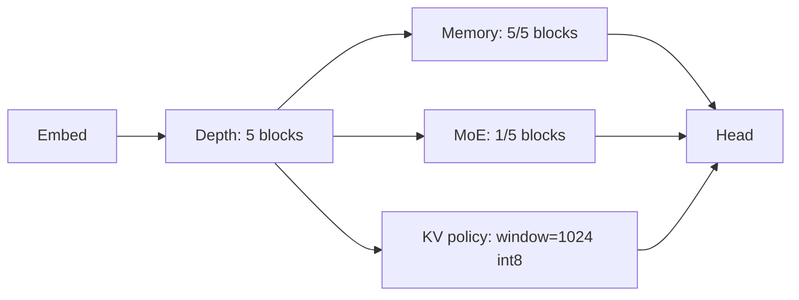
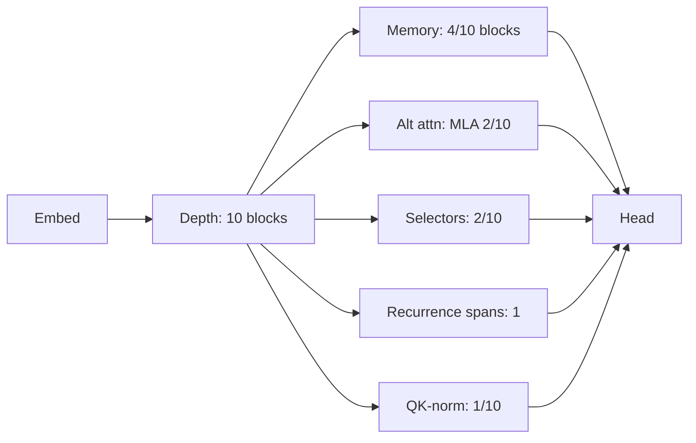
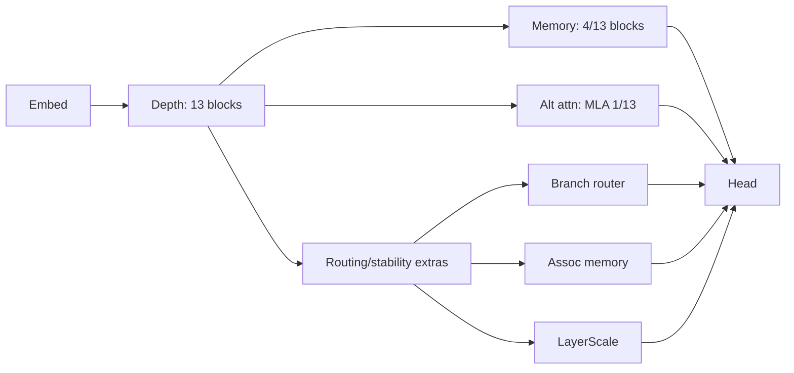

# Transformer Evolution LLM
[](https://deepwiki.com/strangeloopcanon/transformer-evolution-llm)

We’re building an autonomous evolution loop that invents new LLM blueprints we can later scale to full-production budgets. Typed Transformer DSL + mutation templates + checkpoint-aware crossover let us rewrite architectures in YAML, reuse weights after every mutation, and keep an auditable lineage for each discovery. This repository captures the first step of that journey: validating the loop with ~100 M parameter surrogates trained for a few hundred steps so we know which designs deserve the expensive scaling pass.

## What we set out to learn

- Can we evolve genuinely new LLM blueprints—beyond familiar transformer tweaks—using only ~100 M parameter surrogates trained for a few hundred steps?
- Do hybrids (retro memory + sparse attention + MoE/SSM toggles) outperform single tricks when tokens are scarce?
- Is a fully-auditable lineage (JSON + “subway” renders) enough to explain breakthroughs instead of hand-wavy anecdotes?

## What we’re seeing so far

Recent phi-creative sweeps (Pareto-uniform + lexicase) spawned 54 frontier survivors across ~48 generations (`runs/frontier_phi_creative_unbiased.json`, `runs/frontier_phi_creative_overnight_lexi.json`). The runs share the same DSL, mutation deck, and checkpoint-aware crossover; only the selection strategy changes. Diversity is enforced by the selector, not by ad-hoc weighting.

## How it works (tight loop)
- Typed DSL (YAML → Pydantic) defines blocks (attention/MoE/SSM/retro/gates) and training schedule; static checks reject oversized or invalid specs.
- Mutations + template mutations generate candidates; checkpoint-aware crossover splices parent weights so children start warm.
- Live trainer runs short finetunes (rung budgets) with MoE telemetry and safety guards; promotion can grant extra budget to complex candidates.
- Selection uses Pareto/lexicase on PPL, throughput, long-recall proxies, novelty, and graph entropy to keep both simple and complex niches alive.
- Frontier + lineage are JSON; checkpoints are stored per candidate for export or reseeding.

## Signals we keep seeing (from current + prior runs)

- Explicit memory is the most stable motif: when a long-context probe is in the objectives, survivors almost always carry memory primitives (retro + token/chunk/assoc variants) distributed across depth.
- Capacity/routing motifs are conditional: MoE, selector sparsity, and alternate attention kernels show up only when rung0 gates + rung budgets are relaxed enough for them to “stay alive” long enough to train.
- Depth re-use is a frequent path: recurrences appear as a cheap way to add effective depth under tight parameter/throughput budgets.
- Selection pressure dominates outcomes: `map_elites` + an archive maintains multiple niches (memory-heavy vs MoE vs selector vs depth), while tighter gates/selection often collapses to a single regime.

## So what (what this implies)

- This loop is already a useful *architecture microscope*: at ~40–85 M params and a few hundred steps, it reliably rediscovers the same class of building blocks people reach by hand—explicit memory, routing/gating, and depth reuse—without baking in a named target architecture.
- The frontier is a function of constraints: KV/throughput/params gates decide which regimes are even reachable; objective weights decide which motifs are rewarded; and parent selection decides whether niches persist long enough to improve.
- The fact that memory primitives survive across runs suggests they’re “robustly learnable” under scarce-token training, whereas more exotic mixers are either (a) not yet incentivized by our eval, or (b) filtered out by gates/instability before they can pay off.
- The right next proof is not “match a paper’s numbers”, but **convergent motifs + ablations**: multi-seed runs that converge on similar motifs, then short ablations showing which primitives actually drive the proxy gains.

## How constraints shape the frontier

- Structural gates (e.g., minimum layers, expert blocks, selector blocks, memory blocks, and recurrences) define which architectural regime a run explores and prevent collapse into tiny, shallow models.
- Seeds that already satisfy those gates keep evolution in a rich basin: deep, expert-heavy, or memory-heavy patterns emerge as variations on that seed instead of re-deriving basic depth from scratch.
- Mutation mix and multi-step mutations decide which levers move most often; adjusting their weights shifts the frontier between expert-focused, memory-focused, or throughput-lean regimes under the same DSL.
- Score weights and rung budgets say what “better” means: up-weighting long-range recall and structural metrics (and de-emphasizing throughput) allows complex multi-branch stacks to survive and improve instead of being out-selected early.

## How these differ from typical 2025 SOTA stacks

- Multi-branch memory: most candidates embed retro modules in many blocks (5–12 inserts) plus occasional recurrences, unlike vanilla decoder-only stacks with one attention path.
- Mixed kernels per depth: MoE and SSM are interleaved (or staged) across depth, not “all-dense” or “MoE-only” bands.
- Structured sparsity + gating: gated attention variants, sparsity (local_global/dilated), and per-block gated extras appear throughout; standard stacks rarely explore this combination automatically.
- High structural entropy: block order and extras are reshuffled by crossover/mutation, yielding distinct lineages rather than a single scaffold with tuned hyperparameters.

For a more detailed overview of how different evolutionary runs behaved – including the role of structural gates, seeds, mutation mix, and score weights – see `docs/evolution_takeaways.md`.

## Practical next steps

- Reproduce the latest sweep (above) or export a seed for scaling: `scripts/export_seed.py <frontier_path> --id <candidate_id> --out seeds/<name>.pt`.
- Inspect frontier/lineage: `runs/frontier_phi_entropy_v2.json`, `runs/frontier_phi_entropy_v2_lineage.json`.
- Export the DSL JSON Schema (for editor tooling/validation): `PYTHONPATH=src .venv/bin/python scripts/export_dsl_schema.py docs/dsl_schema.json`.
- Run a long-context motif discovery sweep on Mac (MPS): see `configs/exp_longctx_overnight_m4_unbiased.yaml` and the “Long-context discovery run (Mac M4 / MPS)” section below.
- Reclaim disk: new runs save checkpoints as fp16 by default; for older runs use `python -m transformer_evolution_llm.cli cleanup-run runs/<run>.manifest.json --keep frontier+state --apply` and/or `python -m transformer_evolution_llm.cli convert-checkpoints runs/<checkpoint_dir> --dtype fp16 --apply`.
- For a longer SOTA-oriented sweep on a bigger box: reuse `configs/seed_xover-48-9237.yaml` but raise `--generations` (e.g., 200–240), `--steps` (320–384), and consider bumping `rung1_tokens/rung2_tokens` in the config (e.g., 0.6M / 1.8–3.6M) with `promotion_min_layers>=8`, `promotion_min_moe_blocks>=2`; set `--device cuda` if available.
- For historical sweep details, see `RUNS_HISTORY.md` (succinct) or the archived artefact paths noted there.

```bash
# Setup
python -m venv .venv && source .venv/bin/activate
make setup
cp .env.example .env  # add HF_TOKEN=... if needed
export $(cat .env | xargs)

# Smoke test (CPU)
HF_TOKEN="$HF_TOKEN" python scripts/run_live.py \
  configs/live_smoke.yaml --generations 3 --steps 40 --device cpu \
  --out runs/frontier_live_smoke.json

# Full sweep (MPS or CUDA)
AGENT_MODE=baseline HF_TOKEN="$HF_TOKEN" python scripts/run_live.py \
  configs/live_phi_tiny.yaml --generations 48 --steps 200 \
  --eval-batches 4 --device mps \
  --checkpoint-dir runs/checkpoints_phi_tiny \
  --out runs/frontier_phi_tiny.json --seed 1234 --cleanup-old-checkpoints
```

Monitor any run: `tail -f runs/<name>.log` (e.g. `runs/multibranch_weighted.log`).

**Requirements**: Python 3.11+, a Hugging Face token in `.env`, and either CPU, MPS, or CUDA for the short surrogate runs.

</details>

<details>
<summary>Export a frontier winner as a new seed</summary>

```bash
python scripts/export_seed.py runs/frontier_phi_loop_long.json \
  --id mutate_topk-30-bbb0 \
  --out-config configs/seed_mutate_topk.yaml \
  --checkpoint-dir runs/checkpoints_phi_loop_long \
  --out-checkpoint runs/seeds/mutate_topk-30-bbb0.pt
```

Start your next run from `configs/seed_mutate_topk.yaml`; if you provided `--out-checkpoint`, the very first candidate can reuse trained weights.

</details>

<details>
<summary>Long-context discovery run (Mac M4 / MPS)</summary>

This is a disk-safe, local long-context probe run intended for motif discovery (not final scaling). It optimizes `passkey_loss` alongside short-run perplexity without hardcoding any specific module choices. The `*_full_deck.yaml` variant matches the archived long-context frontier examples above; the `*_unbiased.yaml` variant is a tighter baseline with stricter gates.

```bash
export TOKENIZERS_PARALLELISM=false
RUN="runs/exp_longctx_full_deck_m4_$(date +%Y%m%d_%H%M%S)"
HF_TOKEN="$HF_TOKEN" PYTHONPATH=src .venv/bin/python scripts/run_live.py configs/exp_longctx_overnight_m4_full_deck.yaml \
  --device mps --generations 150 --steps 240 --eval-batches 4 --seed 4242 \
  --out "$RUN/frontier.json" --lineage-out "$RUN/frontier_lineage.json" --state-out "$RUN/frontier.state.json" \
  --checkpoint-dir "$RUN/checkpoints" --mutation-steps 3 --prune-checkpoints-to-frontier

PYTHONPATH=src .venv/bin/python scripts/report_motifs.py "$RUN/frontier.json" --lineage "$RUN/frontier_lineage.json" --top 15
```

</details>

## Appendix: operator notes

<details>
<summary>Operator appendix (scale, knobs, ablations, scoring)</summary>

### Scale & portability

- The current phase runs on single-machine surrogates (~100 M parameters, 200–260 step finetunes, local throughput/RAM proxies) so we can vet ideas quickly before investing in large-scale training.
- The methodology (DSL + template mutation + checkpoint-aware evolution + weighted selection) **does generalize**:
  - Swap a bigger spec in `configs/` (wider dims, more heads/experts) and raise `train.max_tokens`, `--steps`, and generations.
  - Keep `grad_ckpt` on; expect heavier MoE/SSM stacks to need more tokens before routers stabilize.
  - Re-tune `--score-weight-*` for production priorities (e.g., raise throughput weight if serving latency dominates; raise layers/MoE if quality is king).
- What’s intentionally out-of-scope here: distributed trainers/ZeRO/TPU setups and true cluster-level SLOs. Treat these runs as **architecture scouting**, then re-train winners at scale.

### Speedrun-style relevance (directional)

The NanoGPT speedrun record for training a 124M model to a target validation loss on FineWeb—typically on an 8×H100 pod—has improved rapidly (community reports went from ~45 minutes to under 3 minutes, with recent figures around ~2.3–2.9 minutes).

So what: once we’re happy with local motif discovery, we can add an optional “speedrun-style” eval path that measures *time-to-target*/*tokens-to-target* under a fixed NanoGPT-like recipe, so architectures are judged on training efficiency (not just short-run perplexity).

### Sparse attention patterns

- The DSL supports `sparsity: none|sliding|block|local_global|dilated|local_block`.
- `sliding` uses `sliding_window` (`sw`) tokens to each side.
- `block` uses `block_size`/`block_stride` windows along the diagonal.
- `local_global` combines a local window with periodic global tokens every `global_stride` steps (plus token 0). The mutation engine explores these knobs automatically via `tune_attn`.
- `dilated` allows attention to tokens that share the same index mod `dilation`.
- `local_block` overlays a sliding window with block windows (configured by `block_size`/`block_stride`), acting like periodic “memory stations.”

### Other knobs

- Global normalization: set `model.norm: layernorm|rmsnorm`.
- KV compression: `attn.kv_groups` can be tuned by evolution (e.g., 1/2/4) to reduce KV cache.
- RoPE base: `attn.rope_theta` adjusts the rotational base (default 10000); mutations can jitter it.

### Macro primitives (declarative)

The DSL also includes an optional `model.kv_policy` plus a `model.macro` section for richer SOTA-style ideas (depth routing, hierarchy/downsampling, parallel/route mixer descriptions, conditioning, and residual variants). These fields are validated, serialized, and included in the JSON Schema/lineage, but are **not yet wired into the training forward pass**.

```yaml
model:
  kv_policy: {cache: window, window: 8192, quant: nf4}
  macro:
    depth_router: {kind: token, budget: 0.7, tau: 1.0, min_layers: 4}
    hierarchy: {levels: [{every: 4, downsample: 0.5, up_proj: true}]}
    residual: {kind: single, pre_ln: true}
    mix_unit:
      kind: par
      merge: WeightedAdd
      choices:
        - {kind: Attention, heads: 8, head_dim: 64}
        - {kind: Retention, heads: 8, head_dim: 64, chunk: 512, mode: parallel}
```

### Optimizers (run-level option)

Keep architecture changes comparable by default with AdamW. You can switch optimizers via the DSL without changing code:

```yaml
optimizer:
  name: lion    # or adamw
  lr: 3.0e-4    # overrides train.lr if set
  betas: [0.9, 0.99]
  weight_decay: 0.01
```

Evolution does not mutate the optimizer by default (to avoid confounding); you decide per-run.

### Scaling tools

- Fit scaling-law priors from existing runs:

```bash
python scripts/fit_scaling.py runs/frontier_phi_creative_unbiased.json \
  runs/frontier_phi_creative_overnight_lexi.json
```

This prints log-log slopes (ppl vs params, tokens vs params, throughput vs hidden×heads) and extrapolated targets.

- See `docs/scale_policy.md` for recommended priors (head_dim≈64, FFN≈4×d, kv_groups≈2, local_global windows ≈ √L × scale) and a checklist for 350 M–1 B scale hops.
- Scale-hop seed: `configs/scalehop_xover-68-8a93.yaml` widens the best-ppl winner to ~400 M params (1536-dim, RMSNorm, kv_groups=2, local_global/local_block/dilated sparsity). Use it on GPU machines with the guidance in `docs/gpu_run_plan.md`.

### Trainer thresholds

Tune early-stop knobs directly in YAML (defaults shown):

```yaml
train:
  entropy_threshold: 0.5
  entropy_patience: 3
  instability_threshold: 5.0
  no_improve_patience: 20
  improvement_tolerance: 1e-3
  ppl_stop_threshold: 2.5   # set null to disable the rung-1 PPL gate
```

These map to the trainer’s entropy/instability/no-improvement guards and the rung‑1 perplexity stop that the evolution runner uses before the full training rung.

The trainer also logs stability telemetry per candidate:

- `stop_reason_code`: 0 = full run, 1 = high_grad, 2 = low_entropy, 3 = no_improve.
- `nan_seen`: 1.0 if any NaN/Inf was observed in loss or gradients, else 0.0.
- `loss_spike`: largest single-step increase in training loss vs the best-so-far.

### Depth recurrence

- Wrap contiguous layer ranges in a recurrence loop using `model.recurrences`:

```yaml
recurrences:
  - start: 1
    end: 4
    adapter: gated      # or linear
    concat_prelude: true
    train_recurrence: 1
    max_train_recurrence: 4
    curriculum_fraction: 0.25
    test_recurrences: [1, 2, 4, 8, 16]
```

- The trainer ramps train-time recurrences over the specified curriculum fraction, then evaluates (and logs) `ppl_code_rec_*` plus `recurrence_gain` at the requested test recurrences.
- Example config: `configs/live_phi_creative_recur.yaml` (includes a short “healing” phase via `data.healing_shards` before fine-tuning on reasoning-heavy shards).

Run a recurrence-aware sweep:

```bash
HF_TOKEN="$HF_TOKEN" python scripts/run_live.py configs/live_phi_creative_recur.yaml \
  --generations 24 --steps 260 --device mps \
  --checkpoint-dir runs/checkpoints_phi_recur \
  --out runs/frontier_phi_recur.json --cleanup-old-checkpoints

# Canonical creative sweep (seeded hybrid + composite metric)
PYTHONPATH=src python scripts/run_live.py configs/seed_xover-48-9237.yaml \
  --generations 48 --steps 360 --eval-batches 6 --device mps \
  --checkpoint-dir runs/checkpoints_phi_creative_canon \
  --out runs/frontier_phi_creative_canon.json --seed 9999 \
  --parent-selection lexicase \
  --score-weight-long-recall 1.2 --score-weight-throughput 1.0 \
  --score-weight-ram 0.8 --score-weight-moe 1.0
```

### Discovered frontier architectures

These are illustrative survivors from the newest long‑context sweep (11‑entry Pareto frontier at ~40–85 M params), archived as YAML for easy inspection/reseeding.

Source (metrics + specs): `configs/frontiers/exp_longctx_full_deck_2h_m4_20251217_003818/frontier_arch.json` (generated from `configs/exp_longctx_overnight_m4_full_deck.yaml`).

- **Quality‑lean memory stack (best `ppl_code`)**  
  Source: `configs/frontiers/exp_longctx_full_deck_2h_m4_20251217_003818/duplicate_block_span+toggle_kv_policy+add_extra_combo-292-4963.yaml`.  
  - Depth: 5 blocks; Memory blocks: 5/5; MoE blocks: 1/5; KV policy: `window=1024` + `int8`.  
  - Proxy metrics: `ppl_code≈121`, `passkey_loss≈7.79`.



- **Probe‑lean hybrid (best `passkey_loss`)**  
  Source: `configs/frontiers/exp_longctx_full_deck_2h_m4_20251217_003818/duplicate_block_span+toggle_qk_norm+add_extra_combo-91-10b3.yaml`.  
  - Depth: 10 blocks; Memory blocks: 4/10; Recurrences: 1; MLA blocks: 2/10; Selector blocks: 2/10; QK‑norm blocks: 1/10.  
  - Proxy metrics: `passkey_loss≈5.43`, `ppl_code≈194`.



- **Deeper routed memory stack (balanced quality)**  
  Source: `configs/frontiers/exp_longctx_full_deck_2h_m4_20251217_003818/insert_assoc_memory+tune_retro+tune_branch_router-375-1123.yaml`.  
  - Depth: 13 blocks; Memory blocks: 4/13; MLA blocks: 1/13; Extras: assoc‑memory + branch‑router + layer‑scale.  
  - Proxy metrics: `ppl_code≈124`, `passkey_loss≈7.52`.



### Ablation harness

Probe how much each motif matters for a frontier winner:

```bash
python scripts/run_ablation.py \
  configs/frontiers/exp_longctx_full_deck_2h_m4_20251217_003818/frontier_arch.json \
  --top-n 2 --device mps --steps 60 --ablation retro_off --ablation kv_groups_to_dense
```

This runs short finetunes on ablated specs (retro off, local_global→sliding, kv_groups→1, rope theta reset, norm swap, remove SSM/MoE) and writes `runs/ablation_report.json` with metric deltas.

### Biasing parent selection

All metrics are equal by default. Heavier weights push toward deeper MoE variants:

```
--score-weight-ppl 2.0 \
--score-weight-throughput 0.3 \
--score-weight-long-recall 1.2 \
--score-weight-ram 0.5 \
--score-weight-layers 1.5 \
--score-weight-moe 1.5
```

You can also steer exploration with:
- `--score-weight-novelty` (maximized) to encourage structural diversity
- `--score-weight-instability` (minimized) to penalize high grad norms

</details>
